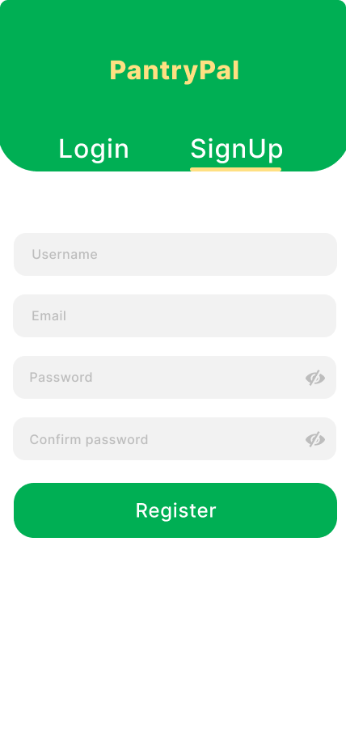
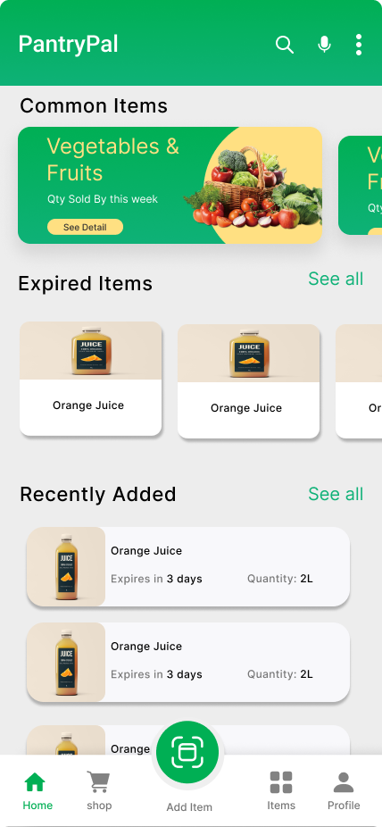

<div align="center">

> Hello world! This is the project’s summary that describes the project plain and simple, limited to the space available. 

**[PROJECT PHILOSOPHY](#project-philosophy) • [WIREFRAMES](#wireframes) • [TECH STACK](#tech-stack) • [IMPLEMENTATION](#impl) • [HOW TO RUN?](#run)**

</div>

<br><br>


> The PantryPal app is an inventory managment system for food where you can add product automatically by scanning the barcode then to keep track on the expiry date.


### User Stories
- As a User I want to be able to scan a product so I can automatically add it to my inventory
- As a User I want to have details on each product so I can track their expiry date and quantities 
- As a User I want to add items with different category so I can manage my inventory
- As a User I want to recieve notifcations alerts about expiry date so I don't waste products

<br><br>


> This design was planned before on paper, then moved to Figma app for the fine details.

   

   


<br><br>


Here's a brief high-level overview of the tech stack the PantryPal app uses:

- This project uses as frontend the [Flutter app development framework](https://flutter.dev/). Flutter is a cross-platform hybrid app development platform which allows us to use a single codebase for apps on mobile, desktop, and the web.
- For database, the app uses [MongoDB](https://www.mongodb.com/).
- For the backend the app uses the [Django web development framework](https://www.djangoproject.com/). Django is a high-level Python web framework that encourages rapid development and clean, pragmatic design.

## 🔌 Plugins
| Technology          | Version | End Point   | Description                                                                                                                                            |
|-----------------|---------|---------------|--------------------------------------------------------------------------------------------------------------------------------------------------------|
|shared_preferences  | 2.0.5   | Front     | Flutter plugin for reading and writing simple key-value pairs.                                                                                         |
| http                | 0.13.1  | Front     | A composable, mulit-platform, Future-based API for HTTP requests.                                                                                      |
| provider            | 5.0.0   | Front     | A wrapper around InheritedWidget to make them easier to use and more reusable.                                                                       |
image_picker        | 0.7.3   | Front     | Flutter plugin for selecting images from the Androind, iOS, and web image library.                                                  |
flutter_barcode_scanner       | 2.0.0   | Front     | Flutter plugin for barcode scanning support on Android and iOS. Supports barcodes, QR codes, etc.                                          |
speech_to_text      | 5.4.3   | Front     | Flutter library that exposes device specific speech recognition capability. This plugin contains a set of classes that make it easy to use the speech recognition  .                                   |
flutter_local_notifications      | 9.4.0  | Front     | A cross platform plugin for displaying and scheduling local notifications for Flutter applications with the ability to customise for each platform.                                   |
| Django_rest_framework     | 3.13.1  | Back      | A powerful and flexible toolkit for building Web APIs  .                                                                                                                           |
| django-cors-headers         | 2.8.5   | Back      | Django CORS middleware .                                                                                                                               |
| djongo            | 1.3.6   | Back      | A SQL to mongodb query compiler. It translates a SQL query string into a mongoDB query document.                                                                                                    |
| Pillow          | 9.0.1   | Back      | A Python Imaging Library .                                                                                                 |
| python-dotenv       | 0.20.0  | Back      | A reads key-value pairs from a .env file and can set them as environment variables.                                                                                              |

Some plugins are not listed may be found in `frontend/pubspec.yaml`. & `server/requirements.txt`.


<br><br>


    


      


<br><br>


### Prerequisites

**Step 1:**
> Get Flutter SDK & Update your Path
Check [Flutter Get Started](https://docs.flutter.dev/get-started/install)

> Android setup. Install Android Studio. Set up your Android device. Set up the Android emulator. Agree to Android Licenses.Check [Android Studio Install](https://developer.android.com/studio/install)

> To make sure everything running.
run in your terminal 
```
flutter doctor
 ```


### Installation
**Step 1:**
>Download or clone this repo by using the link below:

```
https://github.com/Yahya-khodr/pantry
```
**Step 2:**
> Go to frontend directory.

```
cd frontend
``` 
  
**Step 3:**
> Go to project root and execute the following command in console to get the required dependencies: 

``` 
flutter pub get
 ```

**Final Step:**
```
flutter run
```


