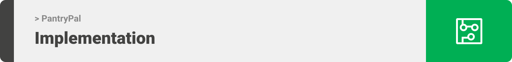

> Hello world! This is the project’s summary that describes the project plain and simple, limited to the space available. 

  

> The PantryPal app is an inventory managment system for food where you can add product automatically by scanning the barcode then to keep track on the expiry date.

### User Stories
- As a User I want to be able to scan a product so I can automatically add it to my inventory
- As a User I want to have details on each product so I can track their expiry date and quantities 
- As a User I want to add items with different category so I can manage my inventory
- As a User I want to recieve notifcations alerts about expiry date so I don't waste products

  

> This design was planned before on paper, then moved to Figma app for the fine details.

| home  | detail  |
| ----------------| -----|
|  |  |

  

Here's a brief high-level overview of the tech stack the PantryPal app uses:

- This project uses as frontend the [Flutter app development framework](https://flutter.dev/). Flutter is a cross-platform hybrid app development platform which allows us to use a single codebase for apps on mobile, desktop, and the web.
- For the backend the app uses the [Django web development framework](https://www.djangoproject.com/). Django is a high-level Python web framework that encourages rapid development and clean, pragmatic design.

  

| home  | detail  | 
| ----------------| -----|
|  |  |  

| scan's detail  | scan's code  | 
| ----------------| -----|
|  |  

  
